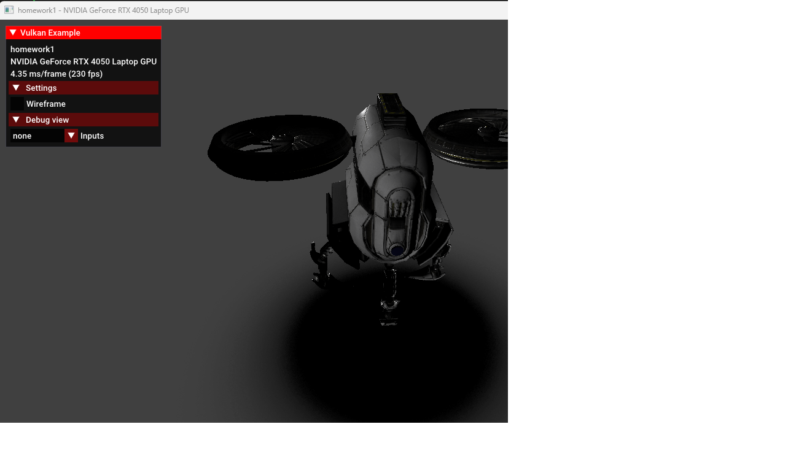
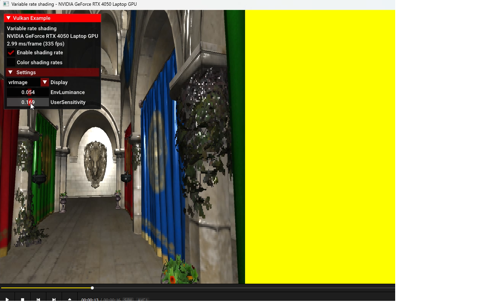

# hc_presentation
This is my presentation of part-time learning

## 图形学

### Games106 homework1

采用 C++ Vulkan glsl

实现：
1. gltf模型加载
2. 骨骼动画
3. pbr材质
4. tonemapping后处理

[动画演示](https://www.bilibili.com/video/BV1TS421w7XU/?spm_id_from=333.999.0.0&vd_source=42933a8483f1416468971bf46a437627)

### Games106 homework2 

采用 C++ Vulkan glsl

实现：
1. Visually Lossless Content and Motion Adaptive Shading in Games 论文中的的描述。根据画面内容动态调整 shading rate。
2. Content Adaptive Variable Shading Rate 根据画面内容的颜色变化程度。
3. Motion Adaptive Variable Shading Rate 根据前后帧的 Motion Vector。

[动画演示](https://www.bilibili.com/video/BV1ti421Z7ac/?spm_id_from=333.999.0.0&vd_source=42933a8483f1416468971bf46a437627)
