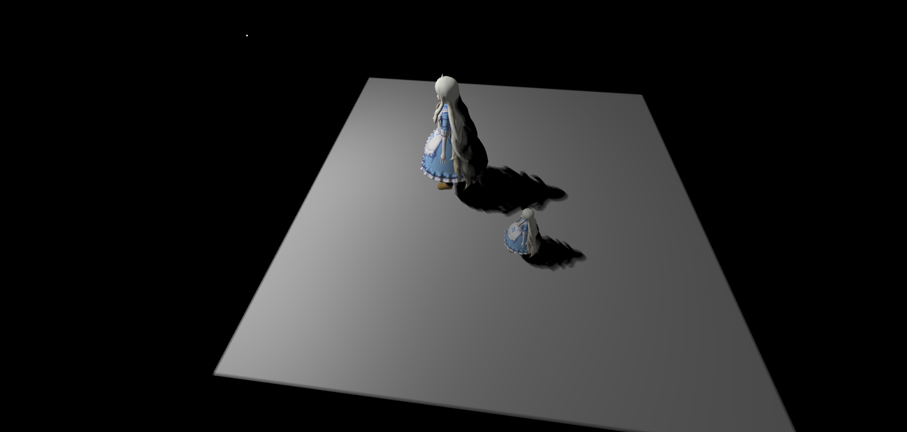
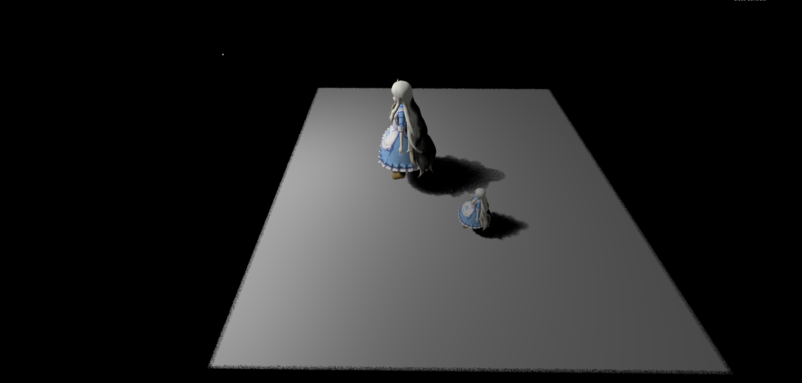

# hc_presentation
This is my presentation of part-time learning

## Games106 Theory and Practice of Modern Graphic Rendering Pipeline

### Games106 homework1

C++ Vulkan glsl

Implement
1. Loading gltf models.
2. Skeleton animation.
3. PBR texture.
4. Tonemapping post process

[video](https://www.bilibili.com/video/BV1TS421w7XU/?spm_id_from=333.999.0.0&vd_source=42933a8483f1416468971bf46a437627)

### Games106 homework2 

C++ Vulkan glsl

Implement
1. Paper Visually Lossless Content and Motion Adaptive Shading in Games.
2. Content Adaptive Variable Shading Rate.
3. Motion Adaptive Variable Shading Rate.

[video](https://www.bilibili.com/video/BV1ti421Z7ac/?spm_id_from=333.999.0.0&vd_source=42933a8483f1416468971bf46a437627)

## Games202 Real-Time High Quality Rendering

### Games202 homework1

Webgl glsl

Implement

1. PCF(Percentage Closer Filter) shadow mapping

2. PCSS(Percentage Closer Soft Shadow) shadow mapping

### Games202 homework2

C++ Webgl glsl

C++ for preprocessing

Webgl glsl for real-time rendering

Implement

1. PRT(Precomputed Radiance Transfer)

### Games202 homework3

Webgl glsl

Implement

1 SSR (Screen Space Ray Tracing), 用 mipmap 实现加速

sample count 5

sample count 10

### Games202 homework4

Webgl glsl

Implement

1 PBR

