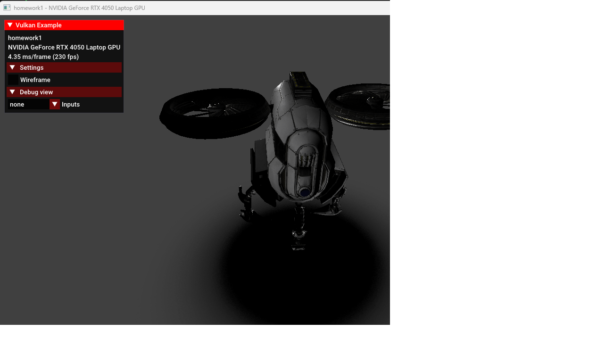
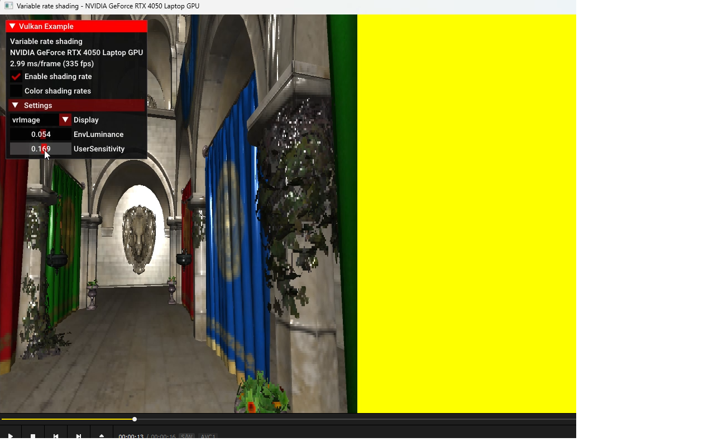
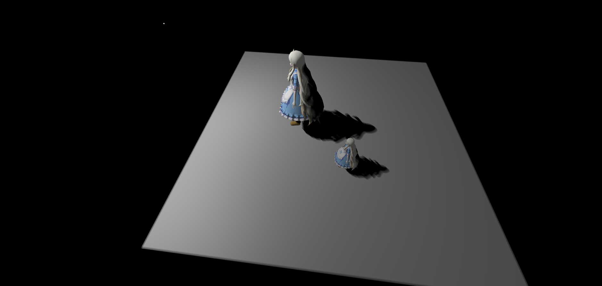
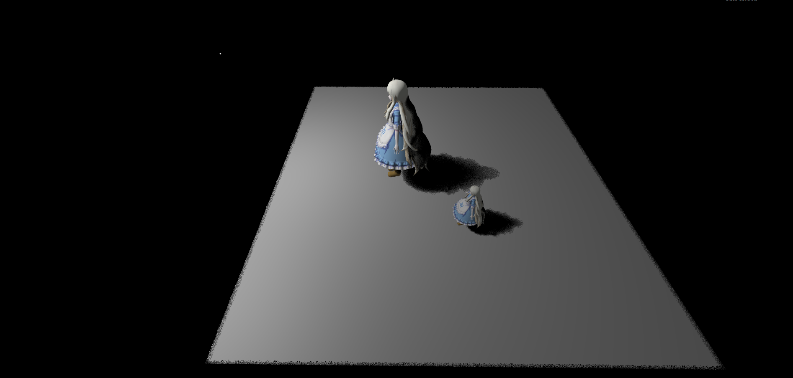
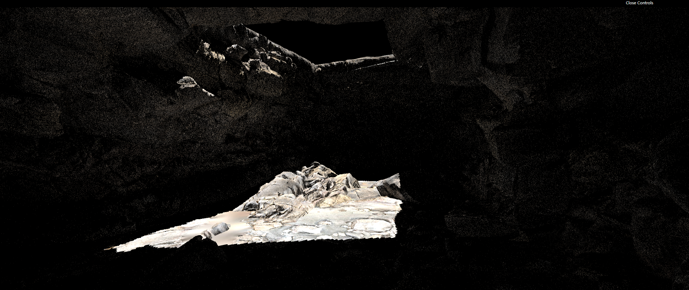
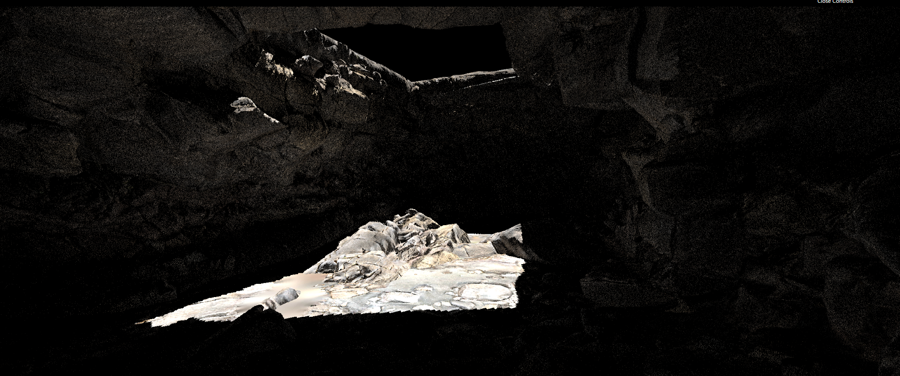
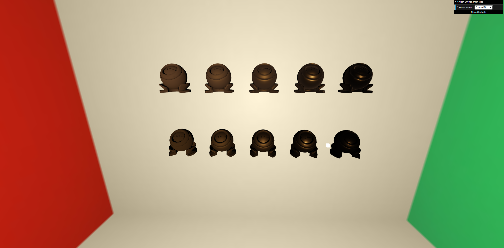

# hc_presentation
This is my presentation of part-time learning

## Games106 现代图形绘制流水线原理与实践

### Games106 homework1

采用 C++ Vulkan glsl

实现：
1. gltf模型加载
2. 骨骼动画
3. pbr材质
4. tonemapping后处理

[动画演示](https://www.bilibili.com/video/BV1TS421w7XU/?spm_id_from=333.999.0.0&vd_source=42933a8483f1416468971bf46a437627)

### Games106 homework2 

采用 C++ Vulkan glsl

实现：
1. Visually Lossless Content and Motion Adaptive Shading in Games 论文中的的描述。根据画面内容动态调整 shading rate。
2. Content Adaptive Variable Shading Rate 根据画面内容的颜色变化程度。
3. Motion Adaptive Variable Shading Rate 根据前后帧的 Motion Vector。

[动画演示](https://www.bilibili.com/video/BV1ti421Z7ac/?spm_id_from=333.999.0.0&vd_source=42933a8483f1416468971bf46a437627)

## Games202 高质量实时渲染

### Games202 homework1

采用 Webgl glsl

实现：

1. PCF(Percentage Closer Filter) shadow mapping

2. PCSS(Percentage Closer Soft Shadow) shadow mapping

### Games202 homework2

采用 C++ Webgl glsl

C++用于预处理

Webgl glsl 用于实时渲染

实现：

1. PRT(Precomputed Radiance Transfer)

### Games202 homework3

采用 Webgl glsl

实现：

1 SSR (Screen Space Ray Tracing), 用 mipmap 实现加速

sample count 5

sample count 10

### Games202 homework4

采用 Webgl glsl

实现：

1 PBR

